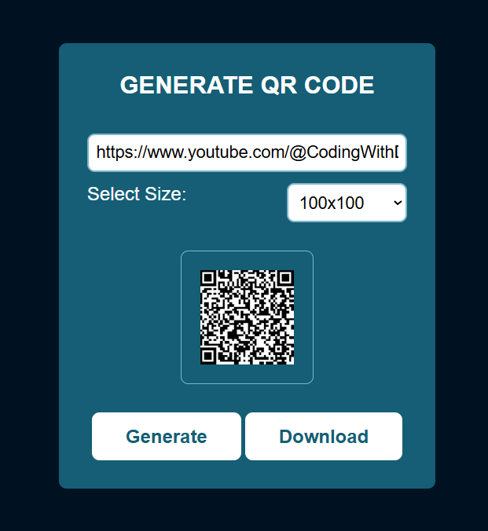

# 🔲 QR Code Generator

A simple and responsive **QR Code Generator** built using **HTML, CSS, and JavaScript**.  
Easily generate QR codes for any text or URL, choose your preferred size, and download it as an image!

---

## 🚀 Features

- 📝 Generate QR codes from text or URLs  
- 📏 Select from multiple size options (100x100 to 1000x1000)  
- 💾 Download the generated QR code as an image  
- ⚡ Real-time regeneration when size changes  
- 🎨 Clean and modern UI design  

---

## 📸 Preview

  

---

## 🛠️ Technologies Used

- **HTML5**   
- **CSS3**  
- **JavaScript**

---

## 📂 File Structure

📦 QR-Code-Generator

├── index.html

├── style.css

├── script.js

└── README.md

---

## 👨‍💻 Author

**Dinesh Singh Dhami**  
🌐 [Visit My Website](https://dineshsinghdhami.com.np)

---

## ©️ Copyright

All rights reserved © 2025 **Dinesh Singh Dhami**
